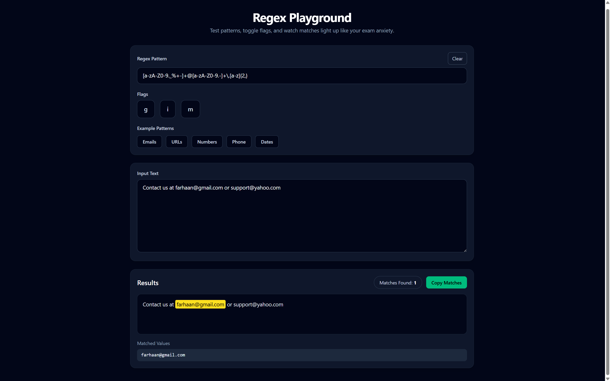

# 🔎 Regex Playground

A lightweight developer tool to test **Regular Expressions (Regex)** interactively.

Built with **React + Vite + TailwindCSS**.

---

## 🚀 Features

- ✨ Live regex matching
- 🔎 Highlighted matches
- ⚙️ Regex flags support
  - `g` → Global search
  - `i` → Case insensitive
  - `m` → Multiline mode
- 📋 Copy matched values
- 🧹 Clear regex pattern
- 📚 Example regex presets
- ⚠️ Live invalid regex detection
- 🎯 Match counter

---

## 🧪 Example Use Cases

Test patterns for:

- Emails
- URLs
- Phone numbers
- Dates
- Numeric values

Example regex:
[a-zA-Z0-9._%+-]+@[a-zA-Z0-9.-]+.[a-z]{2,}

---

## 🛠 Tech Stack

- React
- Vite
- Tailwind CSS
- JavaScript

---

## 📦 Installation

Clone the repository:
git clone https://github.com/Far-200/Regex-Playground.git

Install dependencies:

npm install

Run the development server:

npm run dev

---

## 📷 Preview

A simple developer tool to quickly test and visualize regex patterns.

---

## 🎯 Future Improvements

- Regex cheat sheet panel
- Export matches as JSON
- Dark/light theme toggle
- Regex history

---

## 👨‍💻 Author

Farhaan Khan  
CSE Student | React | AI | Developer Tools
